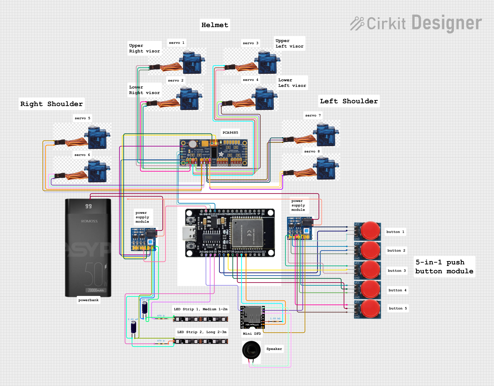

# Project Firefly



## Description

**Project Firefly** is an interactive hardware system combining push buttons, ARGB LED strips, servo motors, a mini speaker, a DFPlayer MINI audio module, and an ESP32 microcontroller. The system is powered by a portable powerbank via a DC-DC converter, providing stable voltages for different components. Users can trigger LED effects, move servos, and play audio through button inputs or programmed logic.

---

## Features

* 5 push buttons for user input
* ARGB LED strips for dynamic lighting
* Multiple servos controlled via PCA9685 PWM driver
* Audio playback using DFPlayer MINI and mini speaker
* Portable powerbank-powered with DC-DC module
* ESP32 handles inputs, outputs, and logic

---

## How The System Works

1. **Input**: Press buttons connected to ESP32 GPIOs.
2. **LED Control**: ESP32 sends signals to LED strips through resistors; capacitors stabilize voltage.
3. **Servo Control**: PCA9685 receives PWM signals from ESP32 to move servos.
4. **Audio Playback**: ESP32 sends UART commands to DFPlayer MINI, outputting to a speaker.
5. **Power Distribution**: DC-DC module converts powerbank voltage to 3.3 V, 5 V, and 12 V rails.

---

## Component List

* Push Buttons (5-in-1)
* 12V ARGB LED Strip (2 strips)
* Mini Speaker
* DFPlayer MINI Audio Module
* Servo Motors (x8)
* PCA9685 PWM Driver
* Resistors: 470 Ω (LED data), 1 kΩ (DFPlayer RX protection)
* Electrolytic Capacitors: 1000 µF / 2200 µF (LED strips)
* DC-DC Power Module (12V → 3.3V, 5V, 12V)
* ESP32 Type C
* Powerbank (20000 mAh)

---

## Wiring Summary (Text/ASCII Diagrams)

### Push Buttons → ESP32

```
[Button1] VCC ----+
[Button2] VCC ----+---> 5V output (DC-DC)
...
GND ---------> Common GND

Button OUTs -----> ESP32 GPIOs
D4, D16, D17, D5, D18
```

### ESP32 → PCA9685 → Servos

```
ESP32 D12 (SDA) ----------------> PCA9685 SDA
ESP32 D13 (SCL) ----------------> PCA9685 SCL
PCA9685 V+ ---------------------> 5V
PCA9685 GND --------------------> GND

PWM0 - PWM7 --------------------> Servo Signals
V+0 - V+7 ----------------------> Servo VCC
GND0 - GND7 --------------------> Servo GND
```

### ESP32 → LED Strips

```
LED Strip 1 (Medium)
ESP32 D15 ----[470Ω]----> DI
Capacitor 1000µF across +5V/GND
+5V ---------------------> LED +5V
GND ---------------------> LED GND

LED Strip 2 (Long)
ESP32 D2 ----[470Ω]----> DI
Capacitor 2200µF across +5V/GND
+5V ---------------------> LED +5V
GND ---------------------> LED GND
```

### ESP32 → DFPlayer MINI → Speaker

```
ESP32 D21 --------------------> DFPlayer RX
ESP32 D19 ----[1kΩ resistor]--> DFPlayer TX
5V ----------------------------> DFPlayer VCC
GND ---------------------------> DFPlayer GND

DFPlayer SPK1 -----------------> Speaker +
DFPlayer SPK2 -----------------> Speaker -
```

### Power Module → System

```
Powerbank USB-C output ---> DC-DC DCin -
Powerbank USB-C input  ---> DC-DC DCin +

DC-DC 5V output -----------> ESP32 5V components
DC-DC 3.3V output ---------> ESP32 3.3V components
DC-DC GND -----------------> Common GND
```

---

## Getting Started

1. Connect components as per wiring diagrams above.
2. Program ESP32 to:

   * Read button inputs
   * Control PCA9685 servos
   * Manage ARGB LED strips
   * Send UART commands to DFPlayer MINI
3. Power system via powerbank + DC-DC module.
4. Test buttons, LED patterns, servo motions, and audio playback.

---

## Technologies Used

* **ESP32 microcontroller**
* **PCA9685 PWM driver**
* **DFPlayer MINI MP3 module**
* **12V ARGB LED strips**
* **DC-DC Power Module**
* **Arduino IDE / PlatformIO**

---

## Future Enhancements

* Wi-Fi / Web-based control for LED, servo, and audio
* More interactive LED patterns
* Additional servo-controlled mechanisms
* Audio triggers based on sensors
* Optimize power efficiency for longer battery life

---

## Changelog

* **v1.0** – Initial wiring documentation
* **v1.1** – Updated pin assignments and added resistors/capacitors
* **v1.2** – Finalized wiring diagrams and component list

---

## Acknowledgements

* DFPlayer Mini documentation
* PCA9685 PWM driver guides
* Arduino / ESP32 community resources

---

## License

This project is licensed under the **MIT License**.

---

